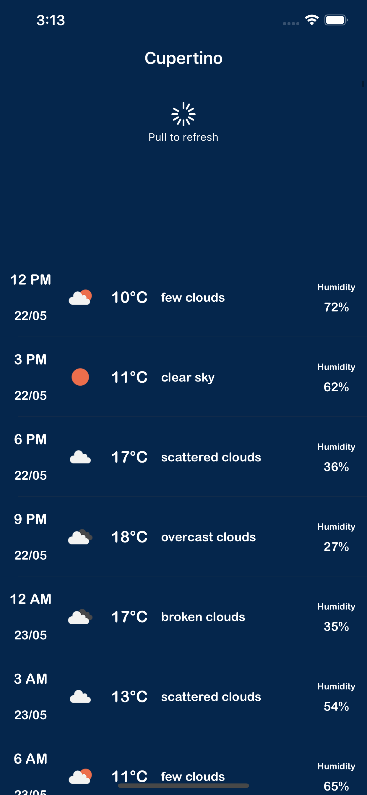

# AwesomeWeather
Awesome weather app is a weather forecast tool, which helps you get the weather details in a simple & elegant way. No fancy stuff just a minimalistic approach.

## Design patters used: MVVM

## How to run the app?
Install Cocoapods if not already.

```
cd AwesomeWeather
pod install
```
Hit run on Xcode after selecting any iPhone simulator

## 3rd Parties used:
```
   Alamofire (for network requests)
```

## How to run tests

Run the unit test case suite in the AwesomeWeatherTests target or Hit CMD + U in Xcode to test test cases


## TODO 

- [ ] Error handling in multiple places
- [ ] Location manager error handing
- [ ] Utility to show alerts throught the app from any point
- [ ] Add settings screen to change location after
- [ ] Multi-location support
- [ ] Cleaner architecture
- [ ] More documentation
- [ ] SiriKit integration
- [ ] Notifications periodically
- [ ] Background fetch
- [ ] Notification center extension to support widgets

# Screenshots

## Welcome screen
   

<div class="page"/>

## Manual selection
   
   
<div class="page"/>

## Weather Home
   

<div class="page"/>

## Pull to refresh
   

